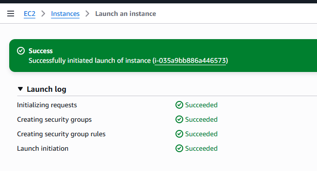
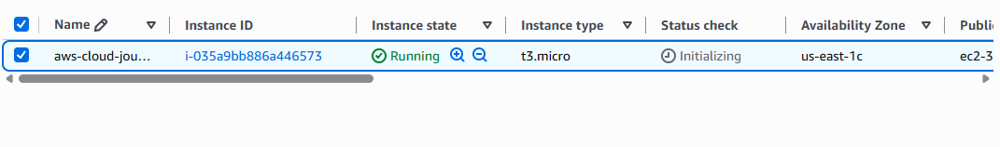
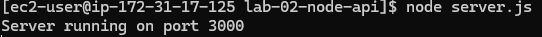
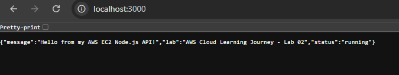
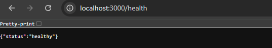
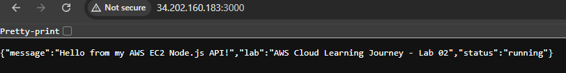
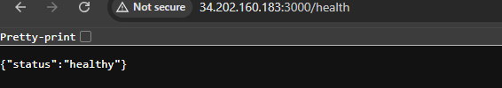

# AWS Cloud Learning Journey - Lab 02

## Deploying a Node.js REST API on Amazon EC2

### Overview

In this lab, I deployed a simple **Node.js and Express REST API** on an **Amazon EC2** instance.

The goal was to move beyond static hosting and understand how a backend application can run on a cloud server and be accessed over the internet.

This lab covered:

* Launching an EC2 instance
* Connecting to a Linux server using SSH
* Installing Node.js
* Deploying a Node.js application
* Configuring an EC2 Security Group
* Exposing an application through port `3000`
* Testing a public REST API
* Managing and cleaning up AWS resources

---

## Architecture

```text
+-----------------+
| Browser/Client  |
+--------+--------+
         |
         | HTTP :3000
         v
+-----------------+
| Internet        |
+--------+--------+
         |
         v
+-------------------------+
| AWS EC2 Instance        |
|                         |
| Amazon Linux            |
|   -> Node.js            |
|   -> Express            |
|   -> REST API :3000     |
+-----------+-------------+
            |
            v
     Security Group
        TCP 3000
```

### Request Flow

```text
Browser
   |
   v
Internet
   |
   v
EC2 Public IP
   |
   v
Security Group
   |
   v
Port 3000
   |
   v
Node.js
   |
   v
Express API
   |
   v
JSON Response
```

---

## Technologies Used

| Technology      | Purpose                             |
| --------------- | ----------------------------------- |
| Amazon EC2      | Cloud server for hosting the API    |
| Amazon Linux    | Operating system running on EC2     |
| Node.js         | JavaScript runtime                  |
| Express.js      | REST API framework                  |
| SSH             | Secure connection to the EC2 server |
| Security Groups | Control inbound network traffic     |
| PowerShell      | Local Windows terminal              |
| GitHub          | Source code and documentation       |

---

## API Endpoints

### `GET /`

Returns information about the deployed application.

Example response:

```json
{
  "message": "Hello from my AWS EC2 Node.js API!",
  "lab": "AWS Cloud Learning Journey - Lab 02",
  "status": "running"
}
```

### `GET /health`

Used to verify that the API is healthy.

Example response:

```json
{
  "status": "healthy"
}
```

---

## Deployment Process

### 1. Created the Node.js application

The API was developed locally using Node.js and Express.

The application listens on port `3000`:

```javascript
const PORT = process.env.PORT || 3000;
```

The server listens on all network interfaces so that it can receive requests through the EC2 instance:

```javascript
app.listen(PORT, "0.0.0.0", () => {
  console.log(`Server running on port ${PORT}`);
});
```

### 2. Launched an EC2 instance

An EC2 instance was created using an Amazon Linux AMI with a Free Tier-eligible instance type.

The instance was configured with:

* Instance name: `aws-cloud-journey-lab-02`
* Security Group: `lab-02-node-api-sg`
* SSH access on port `22`
* Application access on port `3000`

SSH access was restricted to my IP address.

### 3. Connected to EC2 using SSH

The EC2 instance was accessed from Windows PowerShell using the downloaded private key.

```bash
ssh -i <key-file> ec2-user@<EC2-public-ip>
```

### 4. Installed Node.js

Node.js was installed directly on the Amazon Linux server.

The installation was verified using:

```bash
node --version
npm --version
```

### 5. Transferred the application

The following files were transferred from the local development environment to EC2:

```text
package.json
server.js
```

The application was stored on EC2 under:

```text
/home/ec2-user/lab-02-node-api
```

### 6. Installed dependencies

Inside the application directory:

```bash
npm install
```

This installed Express and the application's required dependencies.

### 7. Started the API

The application was started using:

```bash
node server.js
```

The server returned:

```text
Server running on port 3000
```

---

## Security Group Configuration

The EC2 Security Group controlled access to the server.

### Inbound rules

| Protocol | Port | Source      | Purpose            |
| -------- | ---: | ----------- | ------------------ |
| TCP      |   22 | My IP       | SSH administration |
| TCP      | 3000 | `0.0.0.0/0` | Public API access  |

Port `22` was restricted to my IP address, while port `3000` was opened for the API so that it could be accessed from the internet during the lab.

> **Note:** Opening port `3000` to the internet was done specifically for this learning exercise. Production applications should use appropriate network controls and normally place public services behind additional security layers.

---

## Testing

The API was tested locally on the EC2 server using:

```bash
curl http://localhost:3000
```

Health endpoint:

```bash
curl http://localhost:3000/health
```

The API was then tested externally using the EC2 public IP:

```text
http://<EC2-public-ip>:3000
```

Both the main API endpoint and health endpoint returned the expected JSON responses.

---

## Troubleshooting

### SSH private key permissions

Windows initially rejected the `.pem` private key because its file permissions were too open.

The permissions were corrected using Windows `icacls`, allowing SSH authentication to proceed.

### API connectivity

The API was initially tested from inside the EC2 server using `localhost:3000`.

After confirming that Node.js and Express were working, the application was tested externally through the EC2 public IP and port `3000`.

This helped separate application-level problems from network/security-group problems.

---

## Screenshots

### EC2 Instance Creation



### EC2 Instance Running



### Server Running



### API Running Locally



### Health Check Locally



### Hosted Backend on EC2



### Health Check from EC2



---

## What I Learned

This lab helped me understand that deploying a backend application to the cloud involves more than simply uploading code.

I learned how to:

* Launch and configure an EC2 server
* Connect to a Linux cloud server using SSH
* Install and run Node.js on Amazon Linux
* Transfer application files to a remote server
* Configure Security Group rules
* Expose a backend application through a network port
* Test an API both locally and through the internet
* Troubleshoot SSH permissions and network access

The biggest takeaway was understanding the relationship between the **application, server, network port, and AWS Security Group**.

---

## Cleanup

After completing the lab and capturing the required evidence, the AWS resources were cleaned up to avoid leaving unnecessary resources running.

The lab evidence remains in this repository, including:

* Source code
* Screenshots
* Deployment documentation
* Architecture documentation

The AWS environment itself does not need to remain running for the project documentation to demonstrate what was built.

---

## Status

**Lab 02 - Complete**

### Previous Lab

[Lab 01 - S3 Static Website](../01-s3-static-website/)

### Next Lab

**Lab 03 - VPC & Security Groups**
