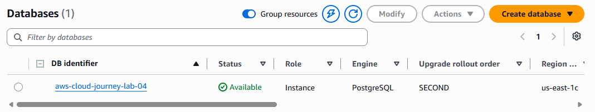
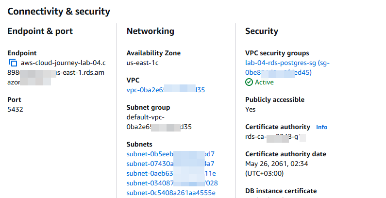
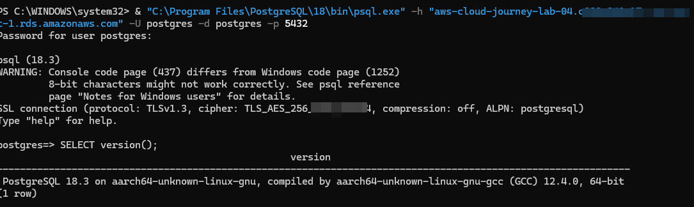
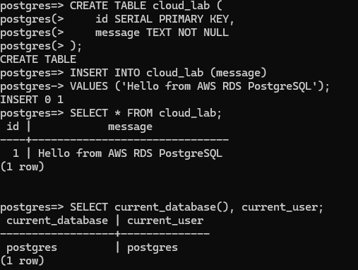
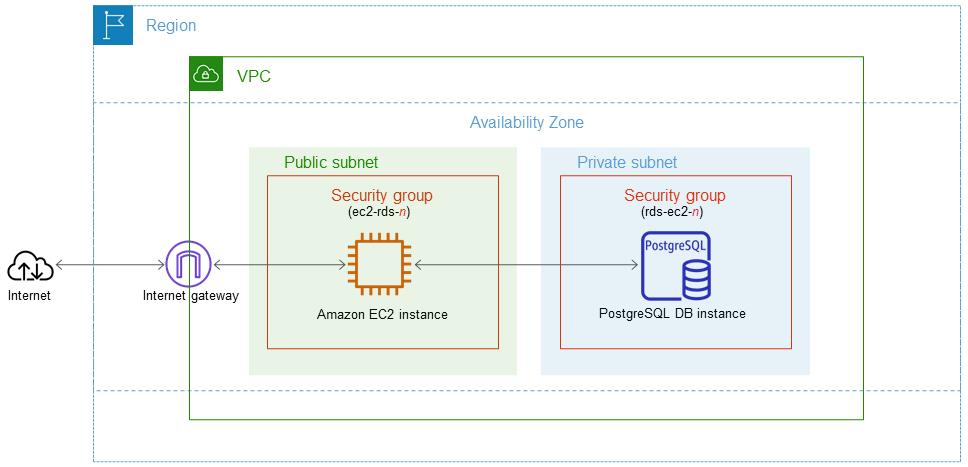

# Lab 04 — Amazon RDS PostgreSQL

## Overview

In this lab, I worked with **Amazon RDS for PostgreSQL** to learn how a managed relational database can be deployed and accessed from a local machine.

The goal was to understand managed databases, database networking, Security Groups, PostgreSQL authentication, SSL/TLS connections, and basic SQL operations.

## What I Built

I created a PostgreSQL database instance using Amazon RDS and connected to it from my Windows machine using the PostgreSQL `psql` command-line client.

The lab involved:

* Amazon RDS for PostgreSQL
* PostgreSQL 18.3
* PostgreSQL `psql` client
* Security Groups
* TCP port `5432`
* SSL/TLS connectivity
* Basic SQL operations

## Architecture

```text
┌─────────────────────────────┐
│       Windows Machine       │
│                             │
│     PostgreSQL psql         │
└──────────────┬──────────────┘
               │
               │ PostgreSQL / TCP 5432
               │ SSL/TLS
               ▼
┌─────────────────────────────┐
│          Amazon RDS         │
│       PostgreSQL 18.3       │
│                             │
│       Database: postgres    │
└─────────────────────────────┘
```

## AWS Resources

### RDS

* DB identifier: `aws-cloud-journey-lab-04`
* Engine: PostgreSQL
* Database: `postgres`
* Port: `5432`
* Public access: Enabled temporarily for this lab
* Deployment: Free Tier configuration

### Security Group

A dedicated Security Group was created for the RDS instance:

`lab-04-rds-postgres-sg`

Inbound PostgreSQL traffic on port `5432` was restricted to my current public IP address.

No open `0.0.0.0/0` database rule was used.

## Connecting to RDS

I used the PostgreSQL 18.3 command-line client already installed on my Windows machine.

The connection was made using:

```bash
psql -h <RDS_ENDPOINT> -U postgres -d postgres -p 5432
```

The password was entered securely when prompted and was not stored in the repository.

The connection was successfully established using SSL/TLS.

The connection reported:

```text
SSL connection (protocol: TLSv1.3)
```

## Testing the Database

After connecting, I verified the PostgreSQL server with:

```sql
SELECT version();
```

The server returned:

```text
PostgreSQL 18.3 on aarch64-unknown-linux-gnu
```

I then created a test table:

```sql
CREATE TABLE cloud_lab (
    id SERIAL PRIMARY KEY,
    message TEXT NOT NULL
);
```

Inserted a test record:

```sql
INSERT INTO cloud_lab (message)
VALUES ('Hello from AWS RDS PostgreSQL');
```

Finally, I queried the table:

```sql
SELECT * FROM cloud_lab;
```

The result confirmed that the record was successfully stored and retrieved from the RDS database:

```text
 id |            message
----+-------------------------------
  1 | Hello from AWS RDS PostgreSQL
```

## What I Learned

This lab helped me understand:

* How Amazon RDS provides a managed PostgreSQL database
* How RDS connectivity works
* The role of Security Groups in controlling database access
* PostgreSQL port `5432`
* How to connect to a remote PostgreSQL database using `psql`
* Basic SQL table creation
* Inserting and retrieving data
* SSL/TLS database connections
* Why database access should be restricted instead of exposing port `5432` publicly

## Troubleshooting

### `psql` command not recognized

The PostgreSQL client was already installed locally, but the `psql` command was not available directly through the Windows PATH.

I located the existing PostgreSQL 18 installation and used:

```powershell
& "C:\Program Files\PostgreSQL\18\bin\psql.exe"
```

This allowed me to use the existing PostgreSQL 18.3 installation without installing another PostgreSQL version.

## Screenshots

The following screenshots provide evidence of the RDS setup, connectivity, PostgreSQL connection, database testing, and architecture used during this lab.

### RDS Database



### RDS Connectivity and Security



### PostgreSQL Connection



### Database Test



### Architecture



> **Security note:** Screenshots were reviewed before being committed to the repository. Passwords, credentials, and other sensitive authentication information should never be committed to GitHub.

## Cleanup

After completing the lab, the RDS resources will be deleted to avoid leaving paid resources running.

Cleanup includes:

1. Delete the RDS database instance
2. Confirm the database is fully deleted
3. Delete the lab-specific RDS Security Group if no longer required

The database password and other credentials are not stored in this repository.

## Lab Status

**Status:** Complete

## Next Lab

Continue building practical AWS cloud infrastructure skills with the next lab.
