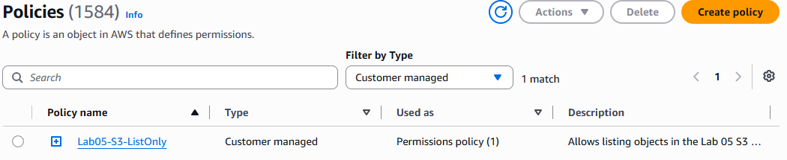
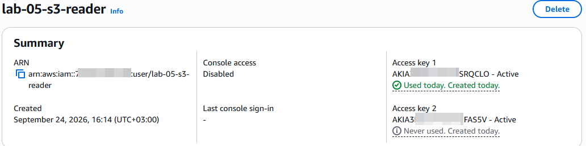
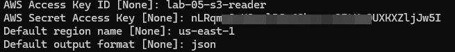
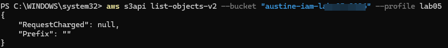
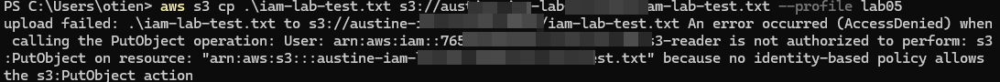

# Lab 05 — AWS IAM & Access Management

## Overview

In this lab, I explored **AWS Identity and Access Management (IAM)** and learned how permissions can be used to control what an AWS user is allowed to do.

The main goal was to understand **least-privilege access** by creating a temporary IAM user with permission to list objects in a specific S3 bucket, while preventing the user from uploading objects.

I also used the **AWS CLI** to authenticate as the IAM user and test the permissions from the command line.

---

## What I Learned

This lab focused on:

* AWS IAM users
* IAM policies
* AWS managed policies
* Custom IAM policies
* Policy actions and resources
* Least-privilege access
* IAM authentication
* AWS CLI profiles
* Amazon S3 permissions
* Testing allowed and denied actions

---

## Architecture

The lab used the following components:

```text
                         AWS Account
                              │
                              ▼
                    IAM User: lab-05-s3-reader
                              │
                              │
                    Custom IAM Policy
                    Lab05-S3-ListOnly
                              │
                              │
                              ▼
                    Amazon S3 Bucket
                 austine-iam-lab-05-2026
                              │
                    ┌─────────┴─────────┐
                    ▼                   ▼
             ListBucket             PutObject
               ALLOWED                DENIED
```

The IAM policy granted only:

```text
s3:ListBucket
```

for the specific lab bucket.

It did not grant:

```text
s3:PutObject
```

---

## AWS Resources

### IAM

* IAM user: `lab-05-s3-reader`
* Custom policy: `Lab05-S3-ListOnly`
* AWS CLI profile: `lab05`

### Amazon S3

* Bucket: `austine-iam-lab-05-2026`

The S3 bucket was created specifically for this learning exercise.

---

## IAM Policy

I created a custom IAM policy named:

```text
Lab05-S3-ListOnly
```

The policy was designed to allow the IAM user to list the contents of the specific S3 bucket.

Policy:

```json
{
  "Version": "2012-10-17",
  "Statement": [
    {
      "Sid": "ListLabBucket",
      "Effect": "Allow",
      "Action": "s3:ListBucket",
      "Resource": "arn:aws:s3:::austine-iam-lab-05-2026"
    }
  ]
}
```

The policy demonstrates the relationship between:

* `Effect`
* `Action`
* `Resource`

Instead of granting broad S3 permissions, the policy was limited to a single action and a single bucket.

---

## IAM Policy Configuration

The custom policy was created through the AWS IAM console.



The policy allows the user to perform `s3:ListBucket` against the specific lab bucket.

---

## IAM User and Permissions

I created a dedicated IAM user for the exercise:

```text
lab-05-s3-reader
```

The user was given only the custom:

```text
Lab05-S3-ListOnly
```

policy.



This helped demonstrate how permissions can be assigned to an individual IAM identity.

---

## AWS CLI Authentication

I configured an AWS CLI profile named:

```text
lab05
```

The profile was used to authenticate as the `lab-05-s3-reader` IAM user.

I verified the identity with:

```powershell
aws sts get-caller-identity --profile lab05
```

The command successfully confirmed that the CLI session was operating as:

```text
lab-05-s3-reader
```



> Access keys were used temporarily for this lab and were not included in this repository.

---

## Permission Test 1 — Listing the S3 Bucket

The first test checked whether the IAM user could list the contents of the S3 bucket.

Command:

```powershell
aws s3api list-objects-v2 --bucket "austine-iam-lab-05-2026" --profile lab05
```

The command completed successfully.

The bucket was empty, so the response indicated that there were no objects to return.



### Result

```text
s3:ListBucket → ALLOWED
```

This confirmed that the custom IAM policy was working as intended.

---

## Permission Test 2 — Attempting an Upload

Next, I attempted to upload a file to the S3 bucket using the same IAM user.

Command:

```powershell
aws s3 cp .\iam-lab-test.txt s3://austine-iam-lab-05-2026/iam-lab-test.txt --profile lab05
```

The operation was rejected with an `AccessDenied` error because the IAM user did not have permission to perform:

```text
s3:PutObject
```



### Result

```text
s3:PutObject → DENIED
```

This was an expected result.

The policy only granted `s3:ListBucket`, so the IAM user could inspect the bucket but could not upload objects.

---

## Permission Summary

| Action                  | Result  | Reason                                  |
| ----------------------- | ------- | --------------------------------------- |
| `sts:GetCallerIdentity` | Allowed | Used to verify the IAM identity         |
| `s3:ListBucket`         | Allowed | Explicitly granted by the custom policy |
| `s3:PutObject`          | Denied  | No policy permission was granted        |

---

## Key Lesson — Least Privilege

The most important concept from this lab was **least privilege**.

Instead of giving an IAM identity broad permissions such as full S3 access, permissions can be limited to exactly what is required.

In this case:

```text
IAM User
    ↓
Lab05-S3-ListOnly
    ↓
s3:ListBucket
    ↓
Specific S3 Bucket
```

The user could perform the required read/list operation but could not modify the bucket.

This demonstrated that IAM policies are not simply about allowing access. They are also about **restricting access to the minimum required actions and resources**.

---

## Troubleshooting

### Invalid AWS Credentials

During the lab, the AWS CLI initially returned:

```text
InvalidClientTokenId
```

The issue was caused by invalid credentials stored in the `lab05` AWS CLI profile.

I verified the profile configuration with:

```powershell
aws configure list --profile lab05
```

After replacing the invalid temporary credentials, I verified the identity again with:

```powershell
aws sts get-caller-identity --profile lab05
```

The authentication test then succeeded.

### Windows File Permission Issue

When creating the temporary test file, PowerShell was initially running from:

```text
C:\Windows\System32
```

Windows denied permission to create the file there.

I moved to the user's home directory and created the test file from there instead.

This was a local Windows permission issue and was unrelated to AWS IAM.

---

## Screenshots

### IAM Policy


### IAM User Permissions


### STS Identity Verification


### S3 List Permission — Allowed


### S3 Upload Permission — Denied


---

## Security Considerations

This lab involved temporary IAM credentials for command-line testing.

The following were **not** included in this repository:

* Access key IDs
* Secret access keys
* Passwords
* AWS credentials files
* Other sensitive authentication information

Temporary credentials should be deleted after the lab is complete.

Screenshots should also be reviewed before publishing to ensure they do not expose sensitive credentials or unnecessary account information.

---

## Cleanup

After completing the tests, the temporary AWS resources should be removed.

Cleanup includes:

1. Delete the temporary IAM access key.
2. Delete the IAM user `lab-05-s3-reader`.
3. Delete the custom policy `Lab05-S3-ListOnly`.
4. Delete the S3 bucket `austine-iam-lab-05-2026`.
5. Remove any remaining local test files.
6. Verify that no Lab 05 resources remain.

The purpose of cleanup is to avoid leaving unnecessary AWS resources or credentials active after the exercise.

---

## What I Learned

This lab helped me understand that AWS security is closely connected to **identity, authentication, authorization, and permissions**.

I learned how to:

* Create IAM users
* Create custom IAM policies
* Define specific AWS actions
* Restrict permissions to specific resources
* Configure an AWS CLI profile
* Verify an AWS identity using STS
* Test allowed permissions
* Test denied permissions
* Apply the principle of least privilege
* Handle temporary credentials safely

The most useful part was testing both sides of the policy instead of only checking whether access worked.

---

## Lab Status

**Status:** Complete

The IAM policy was successfully tested using the AWS CLI.

```text
Authentication      → SUCCESS
ListBucket          → ALLOWED
PutObject           → DENIED
Least Privilege     → VERIFIED
Documentation       → COMPLETE
Cleanup             → PENDING
```

---

## Next Lab

Continue building practical AWS infrastructure and cloud skills through the next hands-on lab.
