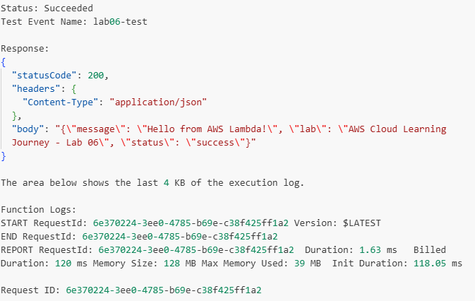
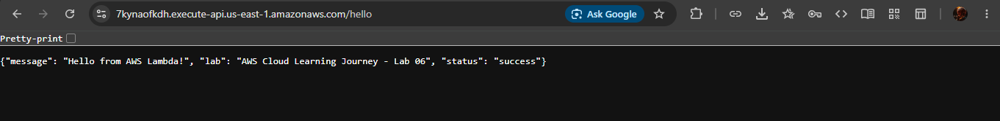
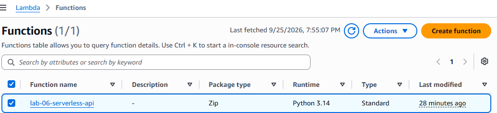
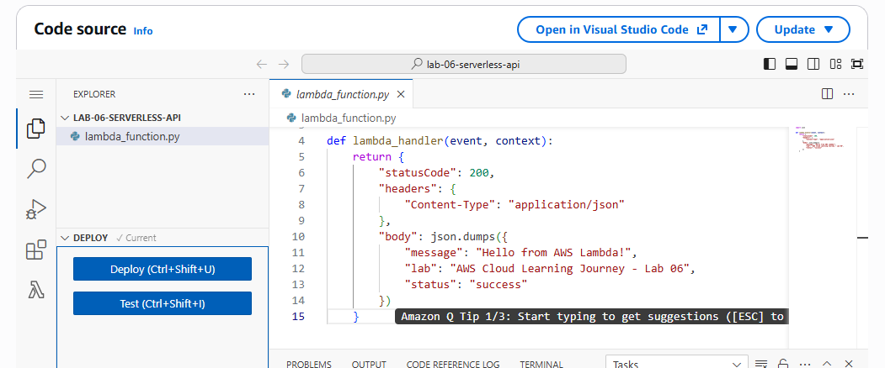
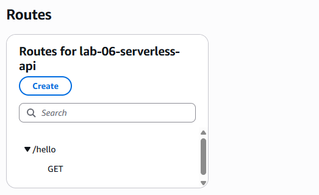

# AWS Cloud Learning Journey — Lab 06

## AWS Lambda & API Gateway — Serverless API

## Overview

In this lab, I built and deployed a simple serverless HTTP API using **AWS Lambda** and **Amazon API Gateway**.

The goal was to understand how a backend application can be exposed through an HTTP endpoint without managing a traditional server such as an EC2 instance.

The API accepts a `GET` request and returns a JSON response from a Lambda function.

---

## Architecture

```text
Client / Browser
       │
       │ HTTP GET /hello
       ▼
Amazon API Gateway
       │
       │ Lambda invocation
       ▼
AWS Lambda
       │
       │ JSON response
       ▼
Amazon API Gateway
       │
       ▼
Client / Browser
```

### AWS Services Used

* **AWS Lambda** — Executes the backend Python function.
* **Amazon API Gateway** — Provides the HTTP endpoint and route.
* **AWS IAM** — Provides the Lambda execution role required for basic logging and execution.

---

## What I Built

I created a Lambda function named:

```text
lab-06-serverless-api
```

The function was written in Python and configured to return an HTTP-compatible JSON response.

The API Gateway HTTP API exposes the Lambda function through:

```text
GET /hello
```

---

## Lambda Function

The Lambda function uses the following code:

```python
import json

def lambda_handler(event, context):
    return {
        "statusCode": 200,
        "headers": {
            "Content-Type": "application/json"
        },
        "body": json.dumps({
            "message": "Hello from AWS Lambda!",
            "lab": "AWS Cloud Learning Journey - Lab 06",
            "status": "success"
        })
    }
```

The function returns an HTTP `200` status code and a JSON response.

---

## Lambda Configuration

The function was created using:

| Setting       | Value                   |
| ------------- | ----------------------- |
| Function name | `lab-06-serverless-api` |
| Runtime       | Python                  |
| Architecture  | x86_64                  |
| Invocation    | API Gateway             |
| Purpose       | Serverless HTTP API     |

---

## API Gateway Configuration

An **HTTP API** was created using Amazon API Gateway.

### Route

```text
GET /hello
```

The route is integrated with:

```text
lab-06-serverless-api
```

API Gateway is responsible for receiving the HTTP request and invoking the Lambda function.

---

## Testing

### 1. Lambda Test

The Lambda function was first tested directly from the AWS Lambda console.

The test completed successfully and returned an HTTP-compatible response.



---

### 2. API Gateway Test

After connecting API Gateway to Lambda, the public API endpoint was tested through a web browser.

The request used:

```text
GET /hello
```

The API successfully returned:

```json
{
  "message": "Hello from AWS Lambda!",
  "lab": "AWS Cloud Learning Journey - Lab 06",
  "status": "success"
}
```



---

## Screenshots

### Lambda Function



### Lambda Code



### Lambda Test


### API Gateway Route



### API Response


---

## What I Learned

This lab helped me understand the difference between running an application on a traditional server and using a serverless architecture.

### Key lessons

* Lambda allows code to run without managing an EC2 server.
* API Gateway can expose Lambda functions through HTTP endpoints.
* Lambda functions can return HTTP-compatible responses for API integrations.
* API Gateway and Lambda can work together to create a lightweight backend.
* Serverless applications can reduce the need to manage traditional server infrastructure.
* Testing the Lambda function directly before connecting API Gateway made troubleshooting easier.

---

## Lab 02 vs Lab 06

This lab also provided a useful comparison with my earlier EC2 Node.js API.

| Lab 02 — EC2                                  | Lab 06 — Lambda                          |
| --------------------------------------------- | ---------------------------------------- |
| Node.js application                           | Python function                          |
| Runs on EC2                                   | Runs on Lambda                           |
| Server instance required                      | No server instance managed by me         |
| Application process runs on server            | Function executes when invoked           |
| HTTP access configured through EC2 networking | HTTP access provided through API Gateway |

This comparison helped me understand two different approaches to deploying backend applications on AWS.

---

## Security Considerations

For this lab:

* No database credentials were used.
* No IAM access keys were created specifically for the Lambda function.
* Lambda uses an IAM execution role.
* The API was created only for learning and testing.
* AWS resources should be removed after completing the lab to avoid unnecessary usage.

---

## Cleanup

After completing the documentation and testing, the temporary AWS resources were removed to avoid unnecessary ongoing usage.

Cleanup includes:

1. Delete the API Gateway HTTP API.
2. Delete the Lambda function.
3. Verify that the Lambda execution role is no longer required.
4. Remove the unused execution role if it was created specifically for this lab.
5. Verify that no Lab 06 resources remain.

The cleanup process is part of the lab because the goal of this learning journey is to practice AWS while avoiding unnecessary ongoing resource usage.

---

## Lab Status

```text
Lambda Function       → COMPLETE
Lambda Testing        → COMPLETE
API Gateway           → COMPLETE
API Testing           → COMPLETE
Documentation         → COMPLETE
Cleanup               → COMPLETE
```

---

## Next Lab

The next lab will build on these fundamentals by introducing another AWS service and increasing the complexity of the architecture.

---

## AWS Cloud Learning Journey

This lab is part of my ongoing hands-on AWS Cloud Learning Journey.

The complete project repository is available here:

**GitHub:**
https://github.com/Austine192-A/aws-cloud-journey
