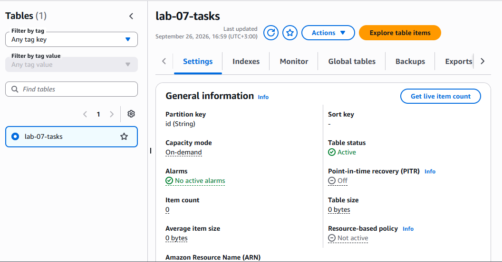
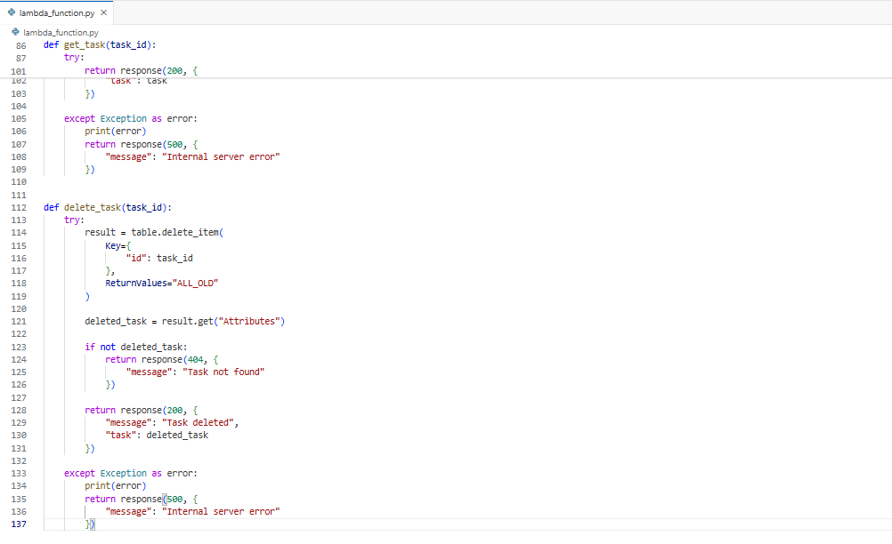
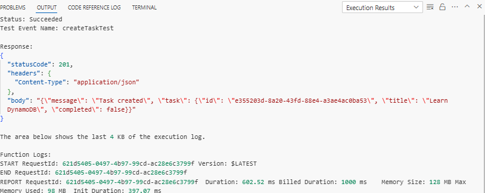
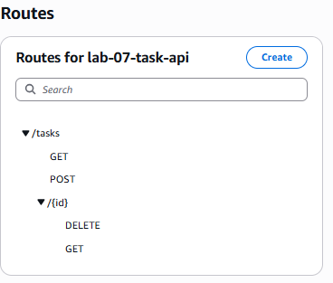
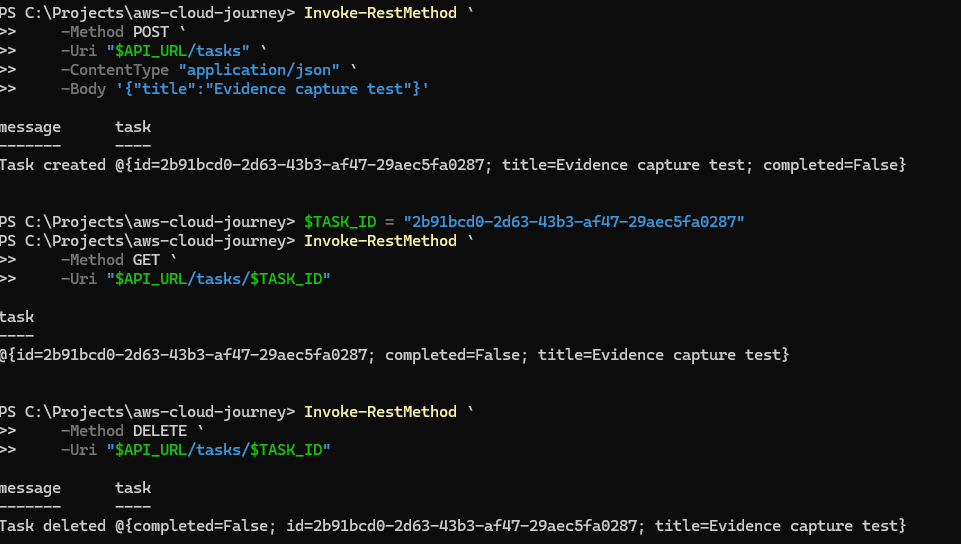

# Lab 07 — Serverless Task API with DynamoDB, Lambda & API Gateway

## Overview

In this lab, I built a serverless task management API using AWS Lambda, Amazon API Gateway, Amazon DynamoDB, and AWS IAM.

The goal was to build a practical backend that could create, retrieve, list, and delete tasks without managing a traditional server.

This lab provided hands-on experience with serverless application architecture, database operations, IAM permissions, API Gateway routing, Lambda testing, PowerShell API testing, and troubleshooting.

---

## Architecture

The application follows a serverless architecture:

```text
Client
   │
   ▼
Amazon API Gateway
   │
   ▼
AWS Lambda
   │
   ▼
Amazon DynamoDB
```

The client sends an HTTP request to API Gateway. API Gateway invokes the Lambda function, which processes the request and reads or writes data in DynamoDB.

---

## AWS Services Used

| Service            | Purpose                            |
| ------------------ | ---------------------------------- |
| Amazon API Gateway | Exposes the HTTP API endpoints     |
| AWS Lambda         | Runs the backend application logic |
| Amazon DynamoDB    | Stores task data                   |
| AWS IAM            | Controls Lambda access to DynamoDB |

---

## 1. DynamoDB Setup

I created a DynamoDB table named:

```text
lab-07-tasks
```

### Configuration

* **Table name:** `lab-07-tasks`
* **Partition key:** `id`
* **Key type:** String

Each task stored in the table follows this structure:

```json
{
  "id": "unique-task-id",
  "title": "Learn DynamoDB",
  "completed": false
}
```

The task ID is generated by the Lambda function using Python's UUID library.

### Evidence



---

## 2. Lambda Function

I created a Lambda function named:

```text
lab-07-task-api
```

### Configuration

* **Runtime:** Python 3.13
* **Architecture:** x86_64
* **Environment variable:** `TABLE_NAME=lab-07-tasks`

The Lambda function contains the application logic for handling the API requests.

It supports:

* Creating tasks
* Listing tasks
* Retrieving individual tasks
* Deleting tasks

### Main operations

```text
POST   → create_task()
GET    → get_tasks()
GET    → get_task()
DELETE → delete_task()
```

### Evidence



---

## 3. IAM Permissions

The Lambda execution role was given permission to interact with the DynamoDB table.

The required DynamoDB actions were:

```text
dynamodb:PutItem
dynamodb:GetItem
dynamodb:Scan
dynamodb:DeleteItem
```

These permissions were provided through an inline IAM policy named:

```text
Lab07TaskTableAccess
```

The policy was scoped to the `lab-07-tasks` DynamoDB table.

This allowed the Lambda function to perform only the database operations required by the application.

---

## 4. Lambda Testing

Before testing the complete API, I tested the Lambda function directly using a Lambda test event.

The test event simulated a `POST` request:

```json
{
  "requestContext": {
    "http": {
      "method": "POST"
    }
  },
  "body": "{\"title\":\"Learn DynamoDB\"}"
}
```

The function successfully created a task and returned a `201` response.

The response included:

* A success message
* A generated task ID
* The task title
* The completion status

### Evidence



---

## 5. API Gateway

I created an HTTP API named:

```text
lab-07-task-api
```

The API was connected to the `lab-07-task-api` Lambda function.

### API Routes

The following routes were configured:

| Method   | Route         | Description              |
| -------- | ------------- | ------------------------ |
| `POST`   | `/tasks`      | Create a new task        |
| `GET`    | `/tasks`      | Retrieve all tasks       |
| `GET`    | `/tasks/{id}` | Retrieve a specific task |
| `DELETE` | `/tasks/{id}` | Delete a specific task   |

### Evidence



---

## 6. API Testing

After configuring API Gateway, I tested the API using PowerShell.

### Create a task

```text
POST /tasks
```

A new task was successfully created and assigned a unique ID.

### List tasks

```text
GET /tasks
```

The API successfully returned the tasks stored in DynamoDB.

### Get a specific task

```text
GET /tasks/{id}
```

The API successfully retrieved a task using its unique ID.

### Delete a task

```text
DELETE /tasks/{id}
```

The API successfully deleted the selected task.

### Verify deletion

After deleting the task, I requested the same task ID again:

```text
GET /tasks/{id}
```

The API correctly returned:

```json
{
  "message": "Task not found"
}
```

This confirmed that the task had been successfully removed from DynamoDB.

### Evidence



---

## 7. Troubleshooting

During the lab, some API routes initially returned:

```json
{
  "message": "Not Found"
}
```

The Lambda function itself was working correctly, and other API operations were successful.

The issue was traced to the API Gateway route configuration.

The affected routes were recreated and connected to the `lab-07-task-api` Lambda function.

After correcting the routes, the API successfully handled:

```text
GET /tasks/{id}
DELETE /tasks/{id}
```

This was an important practical lesson: having working backend code is only one part of building a working API. The API Gateway routes and integrations also need to be configured correctly.

---

## 8. Complete API Flow

The final request flow was:

```text
                   HTTP Request
                        │
                        ▼
              ┌──────────────────┐
              │  API Gateway     │
              │  lab-07-task-api │
              └────────┬─────────┘
                       │
                       ▼
              ┌──────────────────┐
              │     Lambda       │
              │  lab-07-task-api │
              └────────┬─────────┘
                       │
                       ▼
              ┌──────────────────┐
              │    DynamoDB      │
              │   lab-07-tasks   │
              └──────────────────┘
```

The same Lambda function handles all four API operations.

---

## 9. Key Lessons

This lab helped me understand how multiple AWS services can be combined to create a complete serverless backend.

### Technical lessons

* Creating and working with DynamoDB tables
* Connecting Lambda to DynamoDB
* Using IAM to control access between AWS services
* Building HTTP APIs with API Gateway
* Working with API path parameters
* Testing API endpoints using PowerShell
* Troubleshooting API Gateway route configuration
* Verifying that API operations actually change database state
* Understanding the relationship between API Gateway, Lambda, and DynamoDB

### Practical takeaway

The most important lesson was understanding the complete serverless request flow:

```text
Client
  ↓
API Gateway
  ↓
Lambda
  ↓
DynamoDB
  ↓
Lambda
  ↓
API Gateway
  ↓
Client
```

Rather than learning each AWS service separately, this lab demonstrated how they can work together to form a functional backend application.

---

## 10. Evidence

The lab evidence is stored in the `screenshots` directory:

```text
screenshots/
├── 01-dynamodb-task-table.png
├── 02-lambda-function-code.png
├── 03-lambda-test-success.png
├── 04-api-gateway-routes.png
└── 05-api-endpoints-test.png
```

The screenshots provide evidence of:

1. DynamoDB table configuration
2. Lambda function and application code
3. Successful Lambda testing
4. API Gateway route configuration
5. Successful API endpoint testing

---

## 11. AWS Resource Cleanup

After completing the build, testing, and documentation, I removed the AWS resources used for this lab to avoid unnecessary ongoing costs.

The following resources were cleaned up:

* **API Gateway:** `lab-07-task-api`
* **Lambda function:** `lab-07-task-api`
* **Lambda execution role:** Lab 07 execution role
* **DynamoDB table:** `lab-07-tasks`
* **IAM permissions:** `Lab07TaskTableAccess`

The application was fully tested before the resources were removed.

The screenshots and documentation remain in this repository as permanent evidence of the completed lab.

---

## Status

**Lab 07 — Complete and Cleaned Up ✅**

The serverless task API was successfully:

* Built
* Configured
* Tested
* Troubleshot
* Documented
* Cleaned up

The final architecture demonstrated was:

```text
Client
   ↓
API Gateway
   ↓
Lambda
   ↓
DynamoDB
```

All temporary AWS resources used during the lab have been removed.

The project documentation, screenshots, and lessons learned remain available in this repository as evidence of the work completed.

---

## Repository

The complete AWS Cloud Learning Journey is available on GitHub:

**https://github.com/Austine192-A/aws-cloud-journey**
