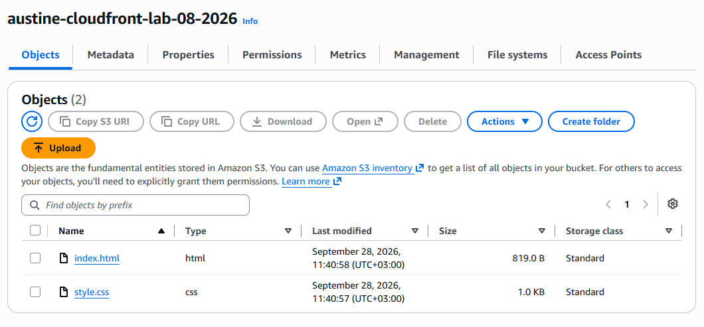
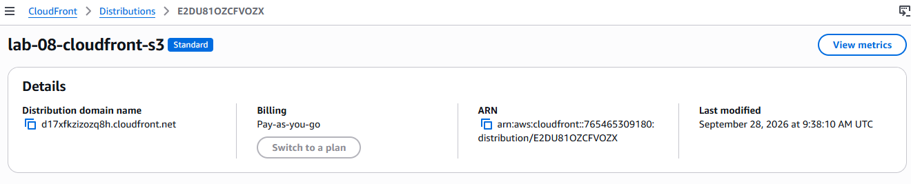
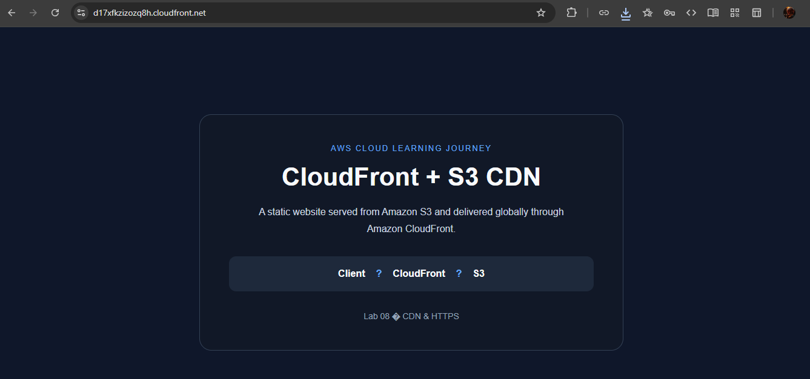
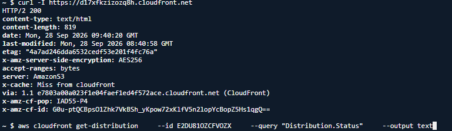

# Lab 08 — CloudFront + S3 CDN

## Overview

In this lab, I deployed a static website to Amazon S3 and used Amazon CloudFront to deliver it globally over HTTPS through a content delivery network (CDN).

The S3 bucket remained private, while CloudFront accessed the bucket securely using **Origin Access Control (OAC)**.

The lab also included troubleshooting an initial `AccessDenied` response and configuring CloudFront to serve `index.html` as the default root object.

---

## Architecture

```text
Client
   │
   │ HTTPS
   ▼
CloudFront
   │
   │ Origin Access Control
   ▼
Amazon S3
   │
   ├── index.html
   └── style.css
```

---

## Objectives

* Create an S3 bucket for static website content
* Upload HTML and CSS files to S3
* Keep the S3 bucket private
* Create a CloudFront distribution
* Configure an S3 origin
* Configure Origin Access Control
* Allow CloudFront to securely retrieve S3 objects
* Configure `index.html` as the default root object
* Test HTTPS delivery through CloudFront
* Troubleshoot an `AccessDenied` response
* Document the implementation and testing
* Clean up the AWS resources after completing the lab

---

## AWS Services Used

* **Amazon S3** — Static website object storage
* **Amazon CloudFront** — Content delivery network and HTTPS entry point
* **CloudFront Origin Access Control (OAC)** — Secure access between CloudFront and S3

---

# Implementation

## 1. Create the S3 Bucket

I created an S3 bucket specifically for this lab:

```text
austine-cloudfront-lab-08-2026
```

The bucket was created in the:

```text
us-east-1
```

region.

The following website files were uploaded:

```text
index.html
style.css
```

### S3 Security

Block Public Access remained enabled.

The S3 bucket was not made publicly accessible. CloudFront was used as the public entry point to the website.

### Evidence



---

## 2. Create the CloudFront Distribution

I created an Amazon CloudFront distribution using the S3 bucket as the origin.

The S3 origin used the bucket's REST endpoint:

```text
austine-cloudfront-lab-08-2026.s3.us-east-1.amazonaws.com
```

CloudFront was configured to use Origin Access Control when communicating with S3.

The resulting CloudFront endpoint was:

```text
https://d17xfkzizozq8h.cloudfront.net
```

### Evidence



---

## 3. Configure Origin Access Control

An Origin Access Control was configured for the CloudFront origin.

OAC allows CloudFront to securely request objects from the private S3 bucket without requiring public read access.

The resulting access flow was:

```text
Browser
   ↓
CloudFront
   ↓ OAC
S3
```

---

## 4. Configure the S3 Bucket Policy

The S3 bucket policy was configured to allow the CloudFront service principal to retrieve objects from the bucket.

The permission required for the website objects was:

```text
s3:GetObject
```

The policy was restricted to the CloudFront distribution rather than making the S3 bucket publicly readable.

### Evidence


---

## 5. Troubleshoot `AccessDenied`

The first time I tested the CloudFront URL, it returned:

```text
AccessDenied
```

Instead of changing multiple configurations at once, I investigated the deployment systematically.

### S3 objects

Using AWS CloudShell, I confirmed that the required objects existed:

```text
index.html
style.css
```

### CloudFront origin

I verified that CloudFront was using the correct S3 REST endpoint.

### Origin Access Control

I verified that an OAC was attached to the CloudFront origin.

### S3 bucket policy

I verified that the bucket policy allowed the CloudFront service principal to retrieve objects.

### Distribution status

I confirmed that the CloudFront distribution had finished deploying.

### Default root object

The remaining issue was that the CloudFront distribution did not have a default root object configured.

I configured:

```text
Default Root Object: index.html
```

CloudFront was then redeployed.

After the deployment completed, the CloudFront endpoint successfully served the website.

---

# Testing

## 6. Test the CloudFront Endpoint

The CloudFront distribution was tested from AWS CloudShell using:

```bash
curl -I https://d17xfkzizozq8h.cloudfront.net
```

The response returned:

```text
HTTP/2 200
content-type: text/html
x-cache: Miss from cloudfront
server: AmazonS3
via: ... (CloudFront)
```

This confirmed that:

* The CloudFront endpoint was reachable
* HTTPS was working
* CloudFront successfully retrieved the website from S3
* The S3 origin was responding correctly
* The request passed through CloudFront

The website was also opened directly in a browser and rendered successfully.

### Browser Test



### Terminal Test



---

# Key Lessons

## Private S3 content can be delivered securely

An S3 bucket does not need to be publicly accessible for CloudFront to deliver its content.

CloudFront can access the bucket using Origin Access Control.

## CloudFront configuration matters

A working S3 bucket does not automatically mean the CloudFront distribution will work.

The following components need to work together:

```text
S3 Bucket
   ↓
S3 Origin
   ↓
Origin Access Control
   ↓
Bucket Policy
   ↓
CloudFront Distribution
```

## Default root objects are important

When a user visits the CloudFront domain without specifying a file, CloudFront needs to know which object should be returned.

For this lab:

```text
index.html
```

was configured as the default root object.

## Troubleshooting should be systematic

The initial `AccessDenied` response was investigated layer by layer instead of changing multiple configurations randomly.

The troubleshooting process involved checking:

1. S3 objects
2. CloudFront origin
3. Origin Access Control
4. S3 bucket policy
5. CloudFront deployment status
6. Default root object

This helped isolate and resolve the issue.

---

# Evidence

The complete evidence for this lab is stored in:

```text
screenshots/
├── 01-s3-bucket-and-files.png
├── 02-cloudfront-distribution.png
├── 03-oac-and-bucket-policy.png
├── 04-cloudfront-website.png
└── 05-cloudfront-terminal-test.png
```

The screenshots demonstrate:

* S3 bucket and uploaded files
* CloudFront distribution
* OAC and S3 bucket policy
* Working CloudFront website
* Successful CloudFront HTTP response

---

# AWS Resource Cleanup

After completing the deployment and capturing the required evidence, the AWS resources created for this lab were cleaned up to avoid unnecessary ongoing costs.

The cleanup includes:

* CloudFront distribution
* S3 bucket
* S3 objects
* Origin Access Control
* CloudFront-related S3 bucket policy

The documentation and screenshots are retained in the repository as evidence of the completed lab.

---

# Final Status

**Lab 08 — COMPLETE**

The lab successfully demonstrated:

* Amazon S3 static content storage
* Private S3 configuration
* Amazon CloudFront
* Origin Access Control
* S3 bucket policies
* HTTPS delivery
* Default root object configuration
* CloudShell testing
* Troubleshooting
* AWS resource cleanup

### Final Architecture

```text
Client
   │
   │ HTTPS
   ▼
CloudFront
   │
   │ OAC
   ▼
Private S3 Bucket
   │
   ├── index.html
   └── style.css
```

**Status: Complete and documented.**

**AWS resources: Cleaned up after testing.**

---

# Repository

AWS Cloud Learning Journey:

https://github.com/Austine192-A/aws-cloud-journey

Lab folder:

```text
08-cloudfront-s3-cdn/
```
