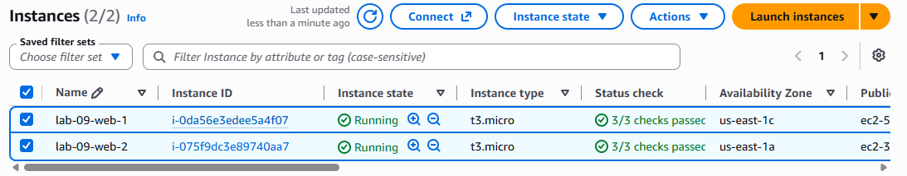
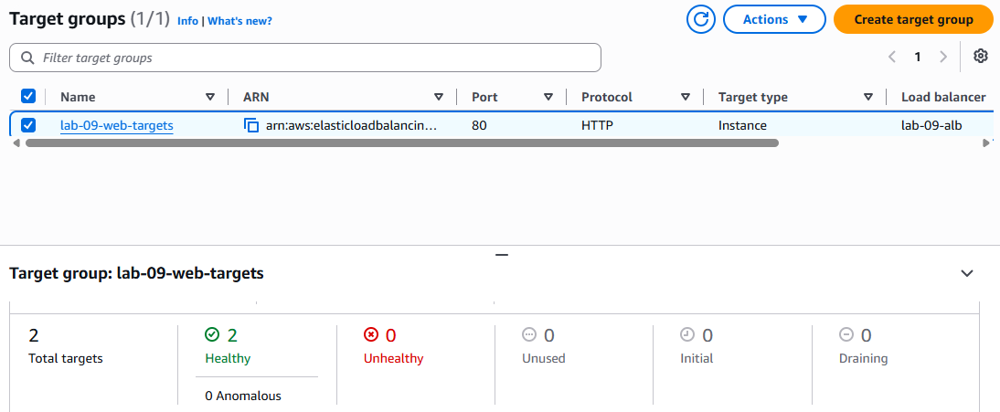
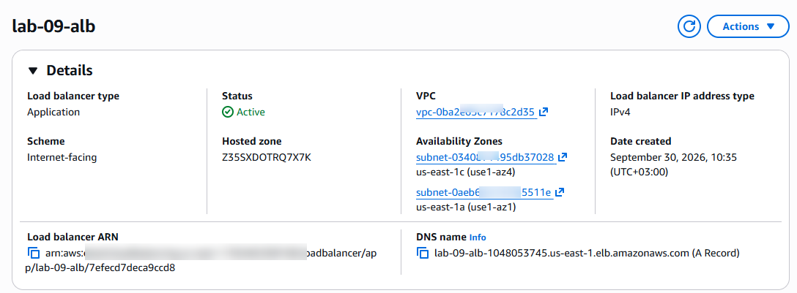
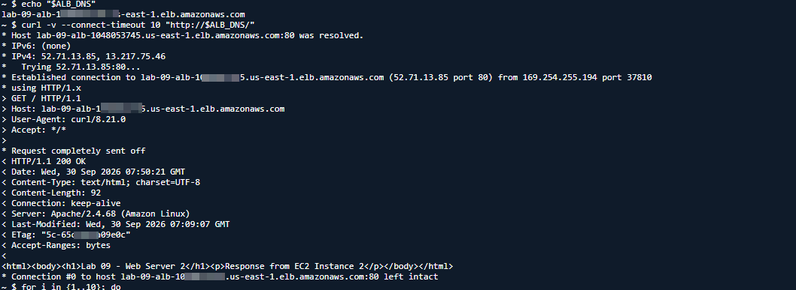
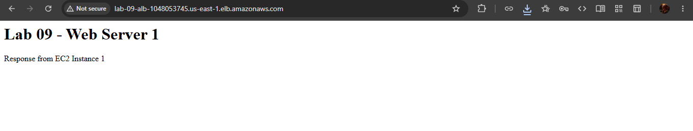
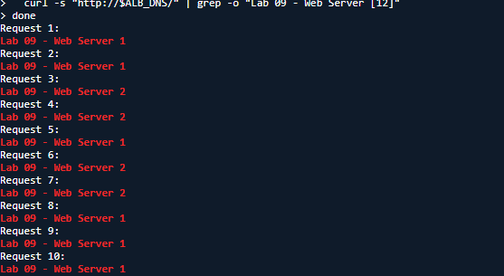

# Lab 09 — Application Load Balancer + EC2

## Overview

In this lab, I built a simple load-balanced web architecture using **Amazon EC2** and an **Application Load Balancer (ALB)**.

The goal was to deploy two web servers and configure an Application Load Balancer to distribute incoming HTTP traffic between them.

## Architecture

```text
                    Internet
                       |
                       v
              Application Load
                 Balancer
                       |
                       v
                 Target Group
                  /         \
                 /           \
                v             v
        EC2 Web Server 1   EC2 Web Server 2
        us-east-1c         us-east-1a
```

## AWS Services Used

* Amazon EC2
* Application Load Balancer
* Elastic Load Balancing
* Target Groups
* Security Groups
* Amazon VPC
* AWS CloudShell

## Infrastructure

### EC2 Web Server 1

* Name: `lab-09-web-1`
* Instance type: `t3.micro`
* Availability Zone: `us-east-1c`
* Operating system: Amazon Linux 2023
* Web server: Apache HTTP Server
* HTTP port: `80`

### EC2 Web Server 2

* Name: `lab-09-web-2`
* Instance type: `t3.micro`
* Availability Zone: `us-east-1a`
* Operating system: Amazon Linux 2023
* Web server: Apache HTTP Server
* HTTP port: `80`

Each server returned a different HTML response to make traffic distribution visible during testing.

## Target Group

Target group:

`lab-09-web-targets`

Configuration:

* Target type: Instances
* Protocol: HTTP
* Port: `80`
* Health check protocol: HTTP
* Health check path: `/`

Both EC2 instances were registered with the target group.

Final health status:

* Web Server 1 — **Healthy**
* Web Server 2 — **Healthy**

## Application Load Balancer

Load balancer:

`lab-09-alb`

Configuration:

* Type: Application Load Balancer
* Scheme: Internet-facing
* IP address type: IPv4
* Listener: HTTP
* Port: `80`
* Default action: Forward traffic to `lab-09-web-targets`

## Testing

The Application Load Balancer was tested using its DNS name:

```text
http://lab-09-alb-1048053745.us-east-1.elb.amazonaws.com/
```

The ALB successfully returned an HTTP `200 OK` response.

Example response:

```html
<html>
<body>
<h1>Lab 09 - Web Server 2</h1>
<p>Response from EC2 Instance 2</p>
</body>
</html>
```

### Load Balancing Test

I sent 10 HTTP requests through the Application Load Balancer.

The requests reached both EC2 instances:

* Web Server 1 — 6 requests
* Web Server 2 — 4 requests

This confirmed that the Application Load Balancer was distributing traffic across the healthy targets.

## Troubleshooting

During the lab, I encountered connectivity issues while attempting to access the EC2 instances through EC2 Instance Connect.

I verified:

* EC2 instance status checks
* Subnet public IP configuration
* VPC routing
* Internet Gateway connectivity
* Security group rules
* SSH connectivity

I also used AWS CloudShell to test connectivity and establish SSH access to the instances.

After resolving the connectivity issue, Apache was configured on both EC2 instances and the web servers were tested successfully.

The ALB was then configured and tested independently, confirming that it could reach both healthy targets and distribute HTTP traffic between them.

## Key Learnings

This lab helped me understand:

* How Application Load Balancers receive HTTP traffic.
* How target groups connect ALBs to EC2 instances.
* How ALB health checks determine target availability.
* How web servers can be distributed across Availability Zones.
* How Security Groups affect application connectivity.
* How to troubleshoot AWS connectivity layer by layer.
* How to verify actual traffic distribution through an ALB.
* The difference between accessing an EC2 instance directly and accessing it through a load balancer.

## Evidence

The following screenshots document the completed lab:

### 1. EC2 Instances



Shows the two EC2 web server instances used in the lab.

### 2. Target Group and Healthy Targets



Shows the target group and both EC2 instances registered as healthy targets.

### 3. ALB Configuration



Shows the Application Load Balancer configuration.

### 4. ALB Listener



Shows the HTTP listener forwarding traffic to the target group.

### 5. ALB Response



Shows the application successfully responding through the ALB DNS name.

### 6. Load Balancing Test



Shows multiple requests reaching both EC2 web servers through the Application Load Balancer.

## Cleanup

After completing the lab and capturing the required evidence, the AWS resources created specifically for this lab were cleaned up.

The following resources were removed:

* Application Load Balancer
* Target group
* EC2 Web Server 1
* EC2 Web Server 2
* Lab security group

The default VPC and its shared networking resources were left unchanged.

This cleanup helps prevent unnecessary AWS usage and costs after completing the learning exercise.

## Conclusion

This lab provided hands-on experience with **EC2, Application Load Balancers, target groups, health checks, security groups, and AWS networking**.

More importantly, it demonstrated the complete process of deploying, testing, troubleshooting, documenting, and cleaning up a real AWS load-balanced architecture.

The lab is now complete and the AWS resources have been cleaned up.
