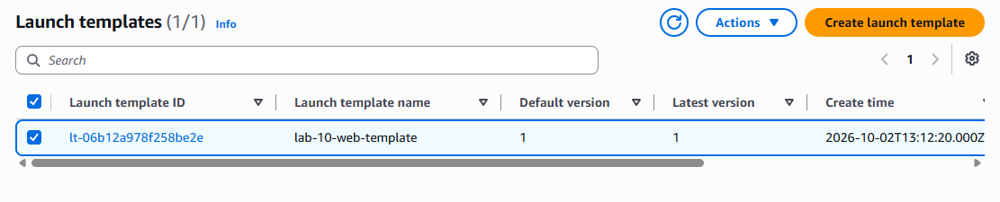
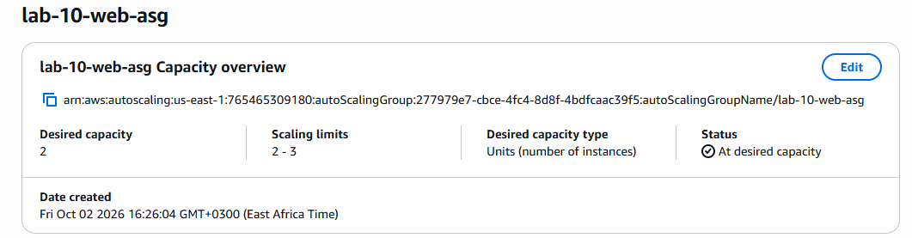
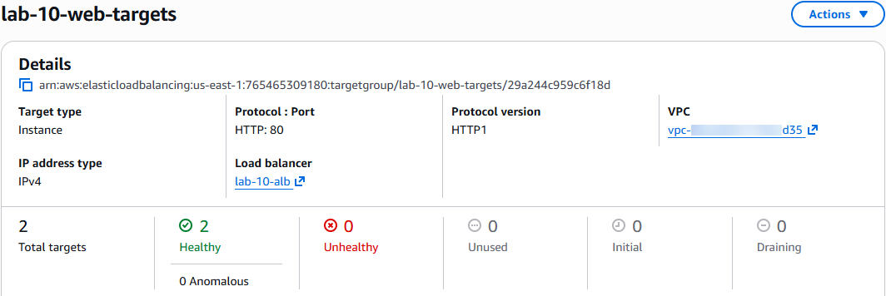
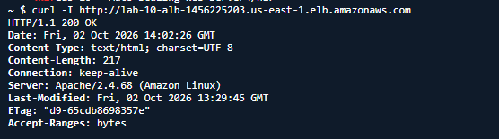
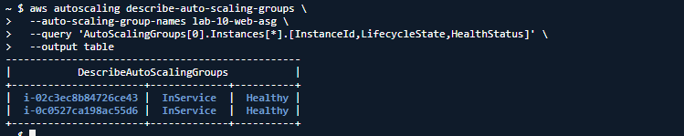
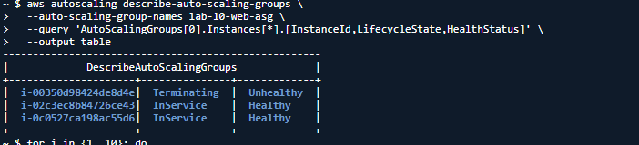
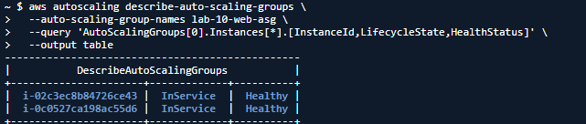

# Lab 10 — EC2 Auto Scaling

## Overview

This lab demonstrated how Amazon EC2 Auto Scaling maintained the desired number of EC2 instances and automatically replaced an instance after it was terminated.

The lab built on the EC2, networking, and Application Load Balancer concepts covered in the previous labs.

The environment used:

* EC2 Launch Templates
* EC2 Auto Scaling Groups
* Application Load Balancer
* Target Groups
* Apache web servers
* EC2 User Data
* Security Groups

---

## Architecture

```text
                         INTERNET
                            |
                            v
                    +---------------+
                    |      ALB      |
                    |  lab-10-alb   |
                    +-------+-------+
                            |
                            v
                    +---------------+
                    | Target Group  |
                    |lab-10-web-    |
                    |   targets     |
                    +-------+-------+
                            |
                            v
                  +--------------------+
                  | Auto Scaling Group |
                  |   lab-10-web-asg   |
                  +---------+----------+
                            |
                     Launch Template
                            |
                  +---------+---------+
                  |                   |
                  v                   v
             EC2 Instance       EC2 Instance
             Apache Web         Apache Web
               Server              Server
```

---

## AWS Services Used

* Amazon EC2
* EC2 Launch Templates
* EC2 Auto Scaling
* Application Load Balancer
* Target Groups
* Security Groups

---

## Resources Created

### Launch Template

A launch template named `lab-10-web-template` was created using:

* Amazon Linux 2023
* `t3.micro`
* Security Group: `lab-10-web-sg`
* EC2 User Data

The launch template provided a reusable configuration for launching the web servers.

### Auto Scaling Group

An Auto Scaling Group named `lab-10-web-asg` was created with:

```text
Minimum capacity : 2
Desired capacity : 2
Maximum capacity : 3
```

The Auto Scaling Group was configured to use the launch template and multiple Availability Zones.

### Application Load Balancer

An internet-facing Application Load Balancer named `lab-10-alb` was created.

It used:

* IPv4
* HTTP
* Port 80

### Target Group

A target group named `lab-10-web-targets` was created with:

* Target type: Instances
* Protocol: HTTP
* Port: 80
* Health check path: `/`

---

## EC2 User Data

EC2 User Data was configured in the launch template to automatically install and start Apache on every newly launched instance.

```bash
#!/bin/bash

dnf install -y httpd

systemctl enable --now httpd

cat > /var/www/html/index.html <<'EOF'
<!DOCTYPE html>
<html>
<head>
    <title>AWS Lab 10</title>
</head>
<body>
    <h1>Lab 10 - Auto Scaling Web Server</h1>
    <p>This server was automatically launched using an EC2 Launch Template.</p>
</body>
</html>
EOF
```

The User Data configuration allowed each EC2 instance to become a functioning web server automatically after launch.

---

## Initial Deployment

After the Auto Scaling Group was created, two EC2 instances were automatically launched.

Both instances entered the `InService` state and were reported as `Healthy`.

The instances were also registered with the target group and passed the configured health checks.

---

## Application Load Balancer Testing

The Application Load Balancer was tested from AWS CloudShell.

The ALB returned a successful HTTP response:

```text
HTTP/1.1 200 OK
```

The response also confirmed that Apache was serving the request:

```text
Server: Apache/2.4.68 (Amazon Linux)
```

The page content was then retrieved successfully and contained:

```html
<h1>Lab 10 - Auto Scaling Web Server</h1>
<p>This server was automatically launched using an EC2 Launch Template.</p>
```

This verified the complete request path:

```text
CloudShell
    ↓
Application Load Balancer
    ↓
Target Group
    ↓
EC2 Instance
    ↓
Apache
    ↓
HTML Response
```

---

## Auto Scaling Self-Healing Experiment

The main experiment tested how the Auto Scaling Group responded when one of its EC2 instances was intentionally terminated.

### Initial state

The Auto Scaling Group initially contained two healthy instances:

```text
i-00350d98424de8d4e   InService   Healthy
i-0c0527ca198ac55d6   InService   Healthy
```

The desired capacity was two instances.

### Instance termination

One of the instances was intentionally terminated:

```text
i-00350d98424de8d4e
```

The instance entered the `Terminating` state and was marked `Unhealthy`.

### Automatic replacement

The Auto Scaling Group detected that the number of healthy instances had fallen below the desired capacity.

It automatically launched a replacement instance:

```text
i-02c3ec8b84726ce43
```

During the replacement process, the Auto Scaling Group temporarily showed:

```text
i-00350d98424de8d4e   Terminating   Unhealthy
i-0c0527ca198ac55d6   InService     Healthy
i-02c3ec8b84726ce43   InService     Healthy
```

The replacement instance was launched using the configured launch template and successfully became healthy.

After the original instance finished terminating, the Auto Scaling Group returned to its desired capacity of two healthy instances.

---

## Final Verification

The final Auto Scaling Group state showed two healthy instances:

```text
InService   Healthy
InService   Healthy
```

The replacement instance was successfully serving as part of the Auto Scaling environment.

The ALB was also tested after the replacement process and continued returning the expected web page.

This demonstrated that the application remained available while an EC2 instance was being replaced.

---

## Troubleshooting

During testing, the ALB initially appeared unreachable from the browser.

The infrastructure was therefore tested directly from AWS CloudShell.

The ALB returned:

```text
HTTP/1.1 200 OK
```

The HTML response was also retrieved successfully.

This confirmed that the ALB, target group, EC2 instances, and Apache web server were functioning correctly.

CloudShell provided a reliable way to verify the AWS infrastructure independently of the browser.

---

## Key Lessons

### Launch Templates

A Launch Template provided a reusable EC2 configuration that could be used whenever the Auto Scaling Group launched an instance.

### Auto Scaling Groups

The Auto Scaling Group maintained the configured desired capacity.

The configuration used in this lab was:

```text
Minimum = 2
Desired = 2
Maximum = 3
```

### Self-Healing

The Auto Scaling Group automatically replaced an EC2 instance after it was terminated.

This demonstrated how Auto Scaling could maintain application capacity without manually launching a replacement server.

### Load Balancing

The Application Load Balancer provided a single endpoint for clients and distributed requests to healthy instances registered in the target group.

### User Data

EC2 User Data automatically configured the web server whenever a new instance was launched.

This was particularly important during the replacement experiment because the replacement instance became a functioning web server without manual configuration.

---

## Screenshots

### 1. Launch Template



### 2. Auto Scaling Group



### 3. Healthy Targets



### 4. ALB Response



### 5. Before Termination



### 6. Replacement Instance



### 7. Final Healthy Instances



---

## AWS Cloud Learning Journey Progress

Lab 10 represented the tenth completed hands-on lab in the AWS Cloud Learning Journey.

```text
01  S3 Static Website Hosting       ✅
02  EC2 Node.js API                 ✅
03  VPC & Networking Fundamentals   ✅
04  RDS PostgreSQL                  ✅
05  IAM & Access Management         ✅
06  Lambda + API Gateway            ✅
07  Serverless Task API             ✅
08  CloudFront + S3 CDN             ✅
09  ALB + EC2                       ✅
10  EC2 Auto Scaling                ✅
```

Each lab built on concepts introduced in previous labs, progressing from individual AWS services toward more complete and resilient application architectures.

---

## Cleanup

After the testing and documentation were completed, the Lab 10 AWS resources were cleaned up to avoid unnecessary ongoing costs.

The following resources were removed:

* Auto Scaling Group
* Application Load Balancer
* Target Group
* Launch Template
* Lab 10 security group
* EC2 instances created by the lab

The shared/default VPC networking was preserved.

---

## Result

Lab 10 successfully demonstrated EC2 Auto Scaling using a Launch Template, Auto Scaling Group, Application Load Balancer, Target Group, Security Group, and automated EC2 User Data.

The self-healing experiment successfully showed that after an EC2 instance was terminated, the Auto Scaling Group automatically launched a replacement and restored the desired capacity of two healthy instances.

This lab provided practical experience with deploying, testing, troubleshooting, documenting, and cleaning up a scalable AWS web application environment.
