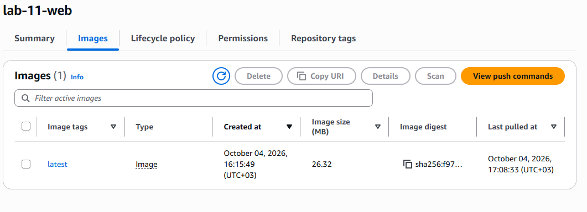
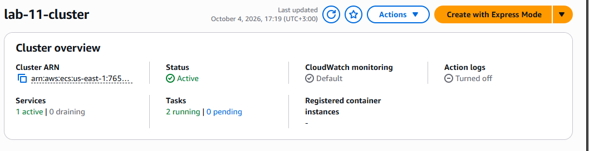
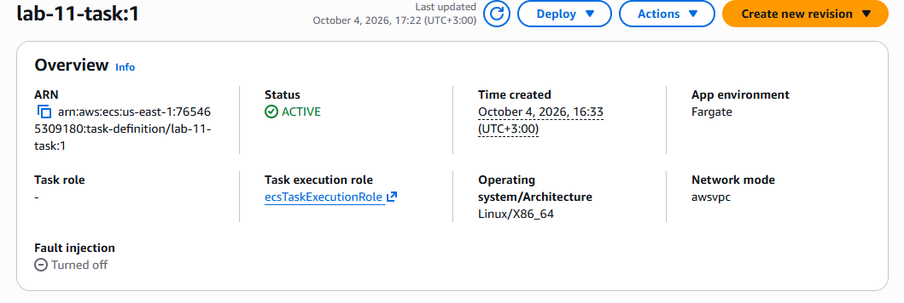
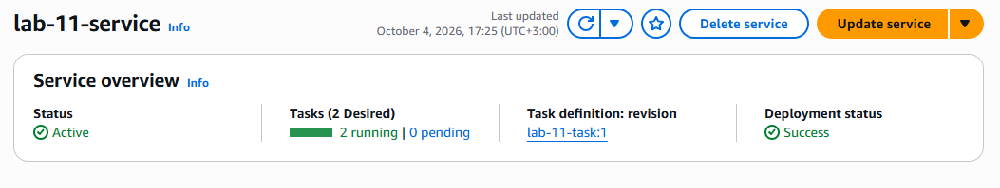
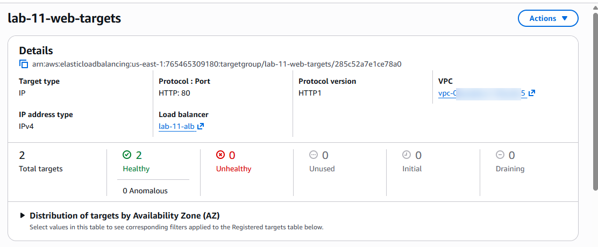
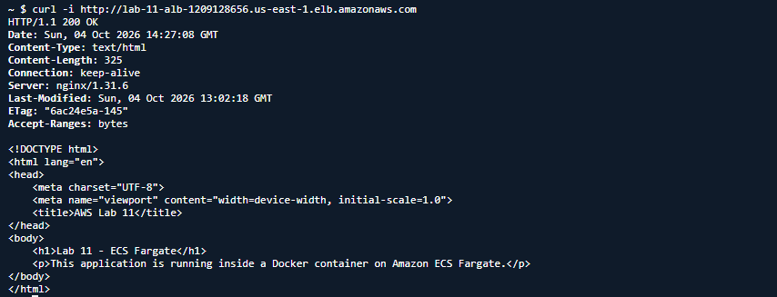
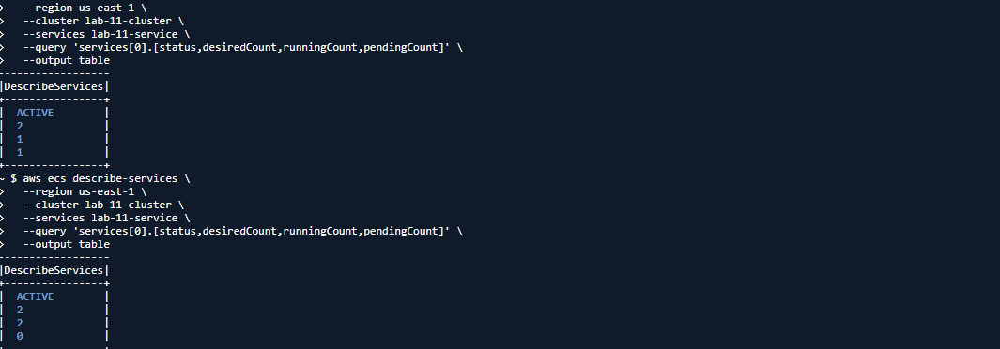

# Lab 11 — Docker + ECS Fargate

## Overview

In this lab, I deployed a containerized web application on AWS using **Docker, Amazon ECR, Amazon ECS with AWS Fargate, and an Application Load Balancer**.

The lab demonstrated the complete container deployment workflow, from creating a Docker image and storing it in ECR to running the application on ECS Fargate and exposing it through an Application Load Balancer.

I also tested ECS service self-healing by deliberately stopping a running task and verifying that ECS automatically launched a replacement.

---

## Architecture

```text
                         INTERNET
                            │
                            ▼
                    ┌───────────────┐
                    │      ALB      │
                    │  lab-11-alb   │
                    └───────┬───────┘
                            │
                            ▼
                    ┌───────────────┐
                    │ ECS Service   │
                    │ lab-11-service│
                    └───────┬───────┘
                            │
                    ┌───────┴───────┐
                    ▼               ▼
              ┌──────────┐    ┌──────────┐
              │ Fargate  │    │ Fargate  │
              │  Task 1  │    │  Task 2  │
              └────┬─────┘    └────┬─────┘
                   │               │
                   └───────┬───────┘
                           ▼
                    ┌─────────────┐
                    │     ECR     │
                    │ lab-11-web  │
                    └─────────────┘
```

### Request Flow

```text
User
 ↓
Application Load Balancer
 ↓
Target Group
 ↓
ECS Service
 ↓
Fargate Tasks
 ↓
Docker Container
 ↓
Nginx
 ↓
HTML Application
```

---

## AWS Services Used

* **Amazon ECR** — Container image registry
* **Amazon ECS** — Container orchestration
* **AWS Fargate** — Serverless container compute
* **Application Load Balancer** — Public traffic distribution
* **Amazon VPC** — Networking
* **Elastic Load Balancing** — Target health checks and routing
* **AWS IAM** — ECS task execution permissions

---

## Technologies Used

* Docker
* Nginx
* HTML
* Linux containers
* AWS CLI
* AWS CloudShell

---

## Project Structure

```text
11-ecs-fargate/
├── Dockerfile
├── index.html
├── README.md
└── screenshots/
    ├── 01-ecr-image.png
    ├── 02-ecs-cluster.png
    ├── 03-task-definition.png
    ├── 04-ecs-service-tasks.png
    ├── 05-healthy-targets.png
    ├── 06-alb-response.png
    └── 07-self-healing.png
```

---

# 1. Created the Web Application

I created a simple HTML application that was used as the workload for the Docker container.

The application displayed:

```text
Lab 11 - ECS Fargate

This application is running inside a Docker container on Amazon ECS Fargate.
```

The application was intentionally kept simple so that the focus of the lab remained on containerization and AWS deployment.

---

# 2. Created the Docker Image

I created a Dockerfile using the lightweight `nginx:alpine` image.

```dockerfile
FROM nginx:alpine

COPY index.html /usr/share/nginx/html/index.html

EXPOSE 80
```

The Dockerfile copied the application into Nginx's default web directory and exposed port 80.

The resulting image was named:

```text
lab-11-web
```

---

# 3. Tested the Docker Container

Docker was not installed locally on my Windows environment, so I used **AWS CloudShell**, which provided Docker and the AWS CLI.

I built the Docker image and started a local container for testing.

The application was tested through port 8080:

```bash
docker run -d --name lab-11-container -p 8080:80 lab-11-web
curl http://localhost:8080
```

The container returned the expected HTML response.

This confirmed that the application worked correctly before being deployed to ECS.

---

# 4. Created the Amazon ECR Repository

I created an Amazon ECR repository named:

```text
lab-11-web
```

The Docker image was tagged for the ECR repository and pushed successfully.

The image stored in ECR was then used by the ECS task definition.



---

# 5. Created the ECS Cluster

I created an Amazon ECS cluster named:

```text
lab-11-cluster
```

The cluster was configured to run workloads using **AWS Fargate**.

During the initial creation attempt, ECS reported that its service-linked role was unavailable. I verified the required `AWSServiceRoleForECS` service-linked role and retried the operation successfully.



---

# 6. Created the ECS Task Definition

I created the task definition family:

```text
lab-11-task
```

The task definition was configured with:

| Configuration        | Value        |
| -------------------- | ------------ |
| Launch type          | Fargate      |
| Operating system     | Linux        |
| Architecture         | x86_64       |
| CPU                  | 1024         |
| Memory               | 3072 MiB     |
| Container name       | `lab-11-web` |
| Container port       | 80           |
| Protocol             | TCP          |
| Application protocol | HTTP         |

The task definition referenced the Docker image stored in Amazon ECR.



---

# 7. Configured Security Groups

I used separate security groups for the Application Load Balancer and ECS web containers.

### Application Load Balancer Security Group

```text
lab-11-alb-sg
```

Inbound HTTP traffic was allowed on port 80 from the internet:

```text
0.0.0.0/0
```

### ECS Web Security Group

```text
lab-11-web-sgv
```

Inbound HTTP traffic on port 80 was restricted to traffic originating from the Application Load Balancer security group.

This created the following traffic flow:

```text
Internet
   ↓
ALB Security Group
   ↓
Application Load Balancer
   ↓
ECS Web Security Group
   ↓
Fargate Tasks
```

This was preferable to allowing public HTTP traffic directly to the ECS tasks.

---

# 8. Created the Target Group

I created the target group:

```text
lab-11-web-targets
```

The target group was configured with:

* Target type: IP
* Protocol: HTTP
* Port: 80
* Health check path: `/`
* Expected successful response: HTTP 200

Because the ECS tasks used Fargate networking, their IP addresses were registered directly with the target group.

---

# 9. Created the Application Load Balancer

I created an internet-facing Application Load Balancer named:

```text
lab-11-alb
```

The ALB was configured with:

* IPv4
* HTTP listener on port 80
* Multiple Availability Zones
* `lab-11-alb-sg`
* `lab-11-web-targets`

The listener forwarded incoming HTTP requests to the ECS target group.

---

# 10. Created the ECS Service

I created the ECS service:

```text
lab-11-service
```

The service was configured with:

```text
Desired tasks: 2
```

The service launched two Fargate tasks and connected them to the Application Load Balancer through the target group.



---

# 11. Verified Healthy Targets

After deployment, both Fargate tasks successfully registered with the target group.

The target health checks reported both tasks as:

```text
healthy
```

This confirmed that the load balancer could communicate successfully with the containers.



---

# 12. Tested the Application Through the ALB

I tested the application through the Application Load Balancer using `curl`.

The response returned:

```text
HTTP/1.1 200 OK
```

The expected application content was also returned:

```html
<h1>Lab 11 - ECS Fargate</h1>
<p>This application is running inside a Docker container on Amazon ECS Fargate.</p>
```

This confirmed the complete request path:

```text
Internet
   ↓
ALB
   ↓
Target Group
   ↓
Fargate Task
   ↓
Nginx
   ↓
HTML
```



---

# 13. Tested ECS Self-Healing

To verify ECS service behavior, I deliberately stopped one of the running Fargate tasks.

The service temporarily dropped below its desired task count.

ECS automatically detected that only one task remained and launched a replacement task.

After the replacement started and passed its health check, the service returned to:

```text
Desired: 2
Running: 2
Pending: 0
```

This demonstrated ECS service self-healing and the ability to maintain the configured desired number of tasks.



---

# 14. Troubleshooting

## Security Group CIDR Error

During the ECS deployment, I encountered the following error:

```text
CIDR block lab-11-alb-sg is malformed
```

The problem occurred because the security group name had been entered into a field expecting an IP address or CIDR block.

I corrected the configuration by using the actual security group ID when referencing the ALB security group as the source of the inbound rule.

This reinforced the distinction between:

* Security group name
* Security group ID
* CIDR block

---

## ECS Service-Linked Role

The initial ECS cluster creation also failed because the required ECS service-linked role was not available.

I verified the `AWSServiceRoleForECS` role and retried the cluster creation successfully.

---

# 15. Key Lessons Learned

This lab helped me understand how modern containerized applications can be deployed on AWS without managing the underlying servers.

The complete workflow was:

```text
Application
     ↓
Docker
     ↓
Amazon ECR
     ↓
ECS Task Definition
     ↓
ECS Service
     ↓
AWS Fargate
     ↓
Target Group
     ↓
Application Load Balancer
     ↓
Internet
```

### Main takeaways

* How Docker packages an application into a container image
* How Amazon ECR stores Docker images
* How ECS task definitions describe container workloads
* How AWS Fargate runs containers without managing EC2 instances
* How ECS services maintain a desired number of running tasks
* How Application Load Balancers route traffic to containers
* How target groups perform health checks
* How security groups control traffic between AWS components
* How ECS can automatically replace a stopped task
* How to troubleshoot AWS networking and deployment configuration errors

---

# 16. Cleanup

After completing the lab, I removed the temporary AWS resources to avoid unnecessary ongoing costs.

The lab resources were cleaned up after the deployment and testing phase.

The cleanup included:

* ECS service
* ECS tasks
* ECS cluster
* Application Load Balancer
* Target group
* ECR repository and container image
* Lab-specific security groups
* Lab-specific IAM resources where applicable

Shared/default VPC networking resources were preserved.

The temporary local Docker container and Docker authentication data were also cleaned up after testing.

---

# Result

The lab successfully demonstrated a complete container deployment workflow using:

**Docker → Amazon ECR → Amazon ECS/Fargate → Application Load Balancer**

The application was successfully containerized, stored in ECR, deployed to two Fargate tasks, exposed through an Application Load Balancer, verified through health checks, and tested for ECS self-healing.

This lab marked my transition from deploying applications directly on EC2 to working with **containerized workloads and serverless container infrastructure on AWS**.
