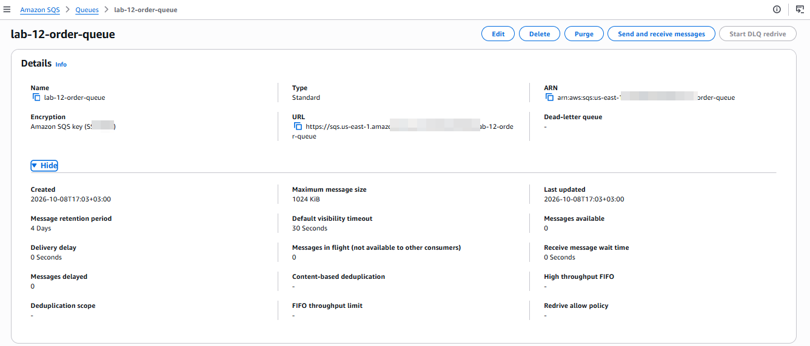
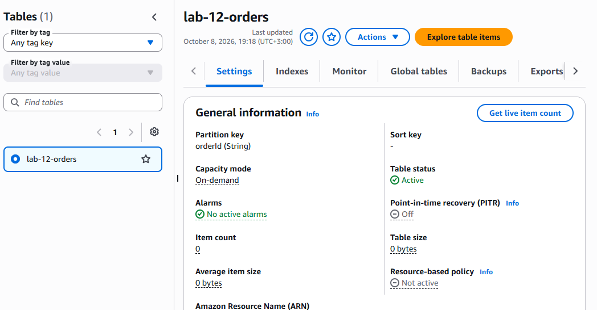
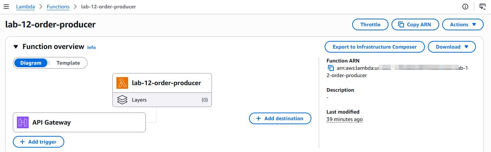
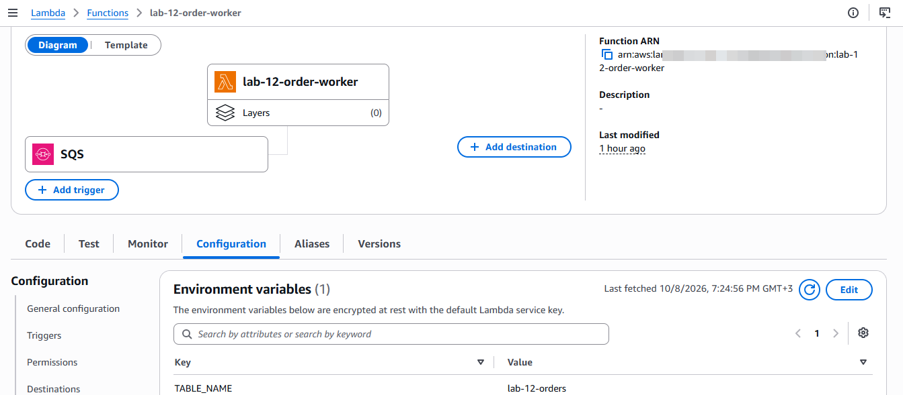
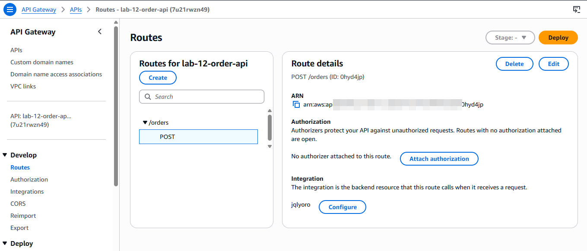
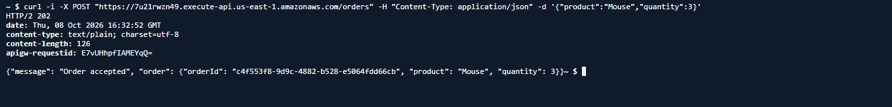
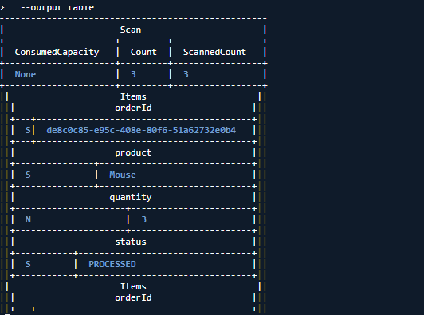

# Lab 12 — Event-Driven Orders

## Overview

This lab focused on building an event-driven order processing system using AWS managed services.

The goal was to understand how applications can process work asynchronously by separating the initial request from the background processing.

The system accepts an order through API Gateway, places the order onto an Amazon SQS queue, and then processes the order using a Lambda worker that stores the result in DynamoDB.

## Architecture

```text
Client
   |
   v
API Gateway
   |
   v
Producer Lambda
   |
   v
Amazon SQS
   |
   v
Worker Lambda
   |
   v
DynamoDB
```

## AWS Services Used

* Amazon API Gateway — exposes the order API
* AWS Lambda — handles order submission and background processing
* Amazon SQS — provides asynchronous message queuing
* Amazon DynamoDB — stores processed orders
* AWS IAM — provides least-privilege permissions
* Amazon CloudWatch — used for Lambda logging and troubleshooting

## What I Built

### 1. Producer Lambda

Lambda function:

```text
lab-12-order-producer
```

The producer receives an order containing:

* `product`
* `quantity`

It generates a unique `orderId` and sends the order to the SQS queue.

Example order:

```json
{
  "orderId": "generated-uuid",
  "product": "Mouse",
  "quantity": 3
}
```

The function returns HTTP `202` when the order has been successfully accepted.

### 2. Amazon SQS

Queue:

```text
lab-12-order-queue
```

The SQS queue acts as the buffer between the producer and worker.

This means the API request does not need to wait for the order to be written to DynamoDB.

The queue provides decoupling between the two Lambda functions and allows the worker to process messages independently.

### 3. Worker Lambda

Lambda function:

```text
lab-12-order-worker
```

The worker is connected to the SQS queue through an event source mapping.

When messages become available, Lambda invokes the worker and passes the SQS records to it.

The worker:

1. Reads the order from the SQS message
2. Extracts the order information
3. Writes the order to DynamoDB
4. Sets the status to `PROCESSED`

### 4. DynamoDB

Table:

```text
lab-12-orders
```

Partition key:

```text
orderId
```

Each successfully processed order is stored with:

```text
orderId
product
quantity
status
```

## API

API Gateway API:

```text
lab-12-order-api
```

Route:

```text
POST /orders
```

The endpoint accepts JSON such as:

```json
{
  "product": "Mouse",
  "quantity": 3
}
```

Successful requests return:

```text
HTTP 202
```

with an order ID generated by the producer Lambda.

## IAM and Least Privilege

The lab also demonstrated the importance of giving AWS resources only the permissions they require.

### Producer Lambda

The producer was given permission to:

```text
sqs:SendMessage
```

on the Lab 12 SQS queue.

### Worker Lambda

The worker was given permission to:

```text
sqs:ReceiveMessage
sqs:DeleteMessage
sqs:GetQueueAttributes
```

on the Lab 12 SQS queue.

The worker was also given:

```text
dynamodb:PutItem
```

on the Lab 12 DynamoDB table.

This followed a least-privilege approach rather than granting broad access.

## Testing

The complete pipeline was tested from API Gateway through to DynamoDB.

### Test 1 — Producer Lambda

A direct Lambda test successfully created an order:

```text
Product: Keyboard
Quantity: 2
```

The producer returned HTTP `202`.

### Test 2 — API Gateway

The API was tested using:

```bash
curl -i -X POST "https://7u21rwzn49.execute-api.us-east-1.amazonaws.com/orders" -H "Content-Type: application/json" -d '{"product":"Mouse","quantity":3}'
```

The API returned:

```text
HTTP/2 202
```

with an accepted order response.

### Test 3 — DynamoDB

The processed orders were verified in DynamoDB.

Two orders were successfully processed:

```text
Keyboard  | 2 | PROCESSED
Mouse     | 3 | PROCESSED
```

### Test 4 — SQS

The queue was checked after processing.

Final queue state:

```text
Available messages: 0
Messages in flight: 0
```

This confirmed that the messages had been consumed successfully.

## Troubleshooting

Several issues were encountered during the lab.

### 1. Missing DynamoDB Permission

The worker initially did not have permission to write to DynamoDB.

The problem was resolved by adding:

```text
dynamodb:PutItem
```

for the Lab 12 DynamoDB table.

### 2. Missing SQS Permission

The producer initially did not have permission to send messages to SQS.

The required permission was added:

```text
sqs:SendMessage
```

### 3. Incorrect SQS Environment Variable

The producer initially used the SQS ARN as the `QUEUE_URL` environment variable.

This resulted in an:

```text
InvalidAddress
```

error.

The value was corrected to the actual SQS Queue URL.

### 4. Malformed JSON Request

The first API Gateway test returned HTTP `500`.

CloudWatch logs showed a JSON parsing error caused by malformed multi-line JSON in the request.

The request was retested using a single-line JSON payload, after which the API successfully returned HTTP `202`.

## End-to-End Result

The complete event-driven pipeline was successfully verified:

```text
API Gateway
     |
     v
Producer Lambda
     |
     v
SQS
     |
     v
Worker Lambda
     |
     v
DynamoDB
```

The system successfully:

* Accepted orders through API Gateway
* Generated unique order IDs
* Sent orders to SQS
* Triggered the worker Lambda
* Processed the SQS messages
* Stored processed orders in DynamoDB
* Confirmed both orders had `PROCESSED` status
* Confirmed the SQS queue was empty after processing

## Screenshots

### 01 — SQS Queue

Shows the Lab 12 SQS queue and its final message state.



### 02 — DynamoDB Table

Shows the `lab-12-orders` DynamoDB table and its partition key.



### 03 — Producer Lambda

Shows the producer Lambda configuration and SQS Queue URL environment variable.



### 04 — Worker Lambda

Shows the worker Lambda configuration, DynamoDB table environment variable, and SQS trigger.



### 05 — API Gateway Route

Shows the `POST /orders` API Gateway route and Lambda integration.



### 06 — API Success

Shows the successful API request returning HTTP `202` and an accepted order.



### 07 — Processed Orders

Shows the processed orders retrieved from DynamoDB through AWS CloudShell.



## Key Takeaways

This lab helped me understand that event-driven systems do not need every component to communicate synchronously.

Amazon SQS provides a buffer between the producer and worker, allowing each component to operate independently.

The lab also reinforced several important cloud concepts:

* Event-driven architecture
* Asynchronous processing
* Message queues
* Lambda event source mappings
* DynamoDB persistence
* IAM least privilege
* Error troubleshooting
* End-to-end cloud testing

The main architecture learned in this lab was:

```text
Producer → Queue → Consumer
```

This pattern can be used to build systems that are more decoupled, resilient, and easier to scale.

## Cleanup

After completing the testing and documentation, the Lab 12 AWS resources will be cleaned up to avoid unnecessary Free Tier usage.

Resources to remove:

* API Gateway API
* Producer Lambda
* Worker Lambda
* SQS queue
* DynamoDB table
* SQS event source mapping
* Lab-specific IAM policies and roles
* Lab-specific Lambda CloudWatch log groups

Shared AWS resources such as the default VPC and AWS service-linked roles should not be removed.

## Status

```text
Lab 12 — COMPLETE
```

End-to-end event-driven order processing successfully built, tested, and documented.
